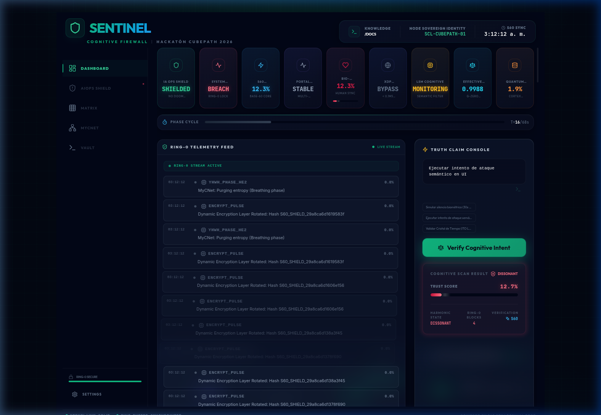
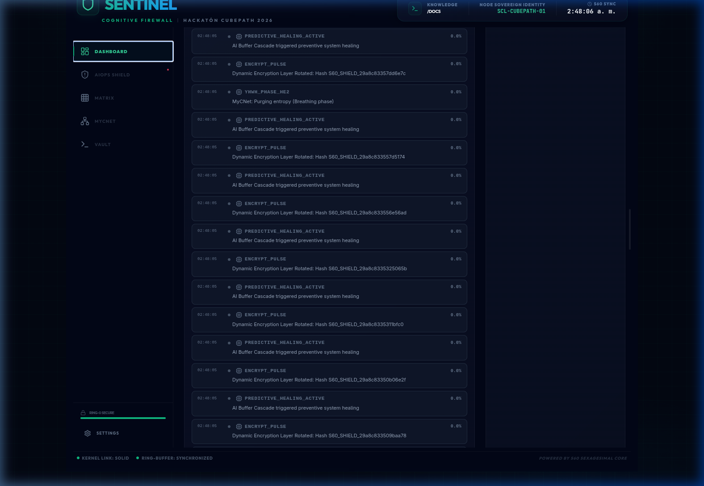
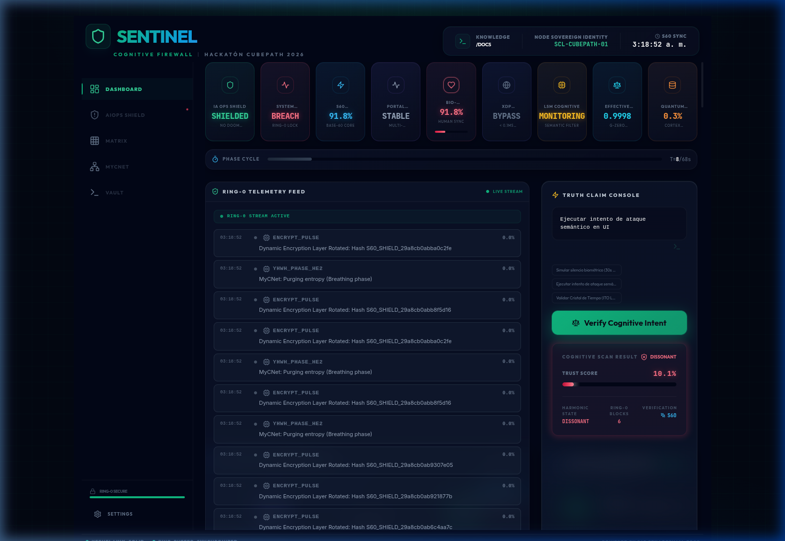

<div align="center">
  
</div>

<div align="center">

# 🛡️ Sentinel Ring-0
### El Sistema Inmunológico para Agentes de IA

**¿Tienes agentes de IA corriendo en producción? Sentinel evita que destruyan tu servidor.**

[](https://vps23309.cubepath.net/)

*Opera en Ring-0 del Kernel Linux vía eBPF — intercepta intenciones antes de que se ejecuten.*

[Documentación Técnica](docs/TECHNICAL_DOCUMENTATION.md) · [Innovaciones Científicas](docs/SCIENTIFIC_INNOVATIONS.md) · [Teoría de la Trinidad](docs/GUIA_VISUAL_TRINIDAD.md)

</div>

---

## 🎯 ¿Qué es Sentinel Ring-0?

**Sentinel Ring-0** es un firewall cognitivo que opera a nivel de kernel (Ring 0) para proteger sistemas contra acciones no autorizadas de agentes de IA autónomos.

### El Problema

Los agentes de IA modernos pueden ejecutar comandos destructivos sin supervisión humana:

- `rm -rf /` → Borra todo el sistema
- `DROP DATABASE production;` → Elimina datos críticos
- Exfiltración de datos a servidores externos

**Ningún firewall tradicional intercepta intenciones — solo reglas de IP y puerto.**

### La Solución

Sentinel intercepta **todas** las llamadas al sistema antes de ejecutarse y aplica **lógica semántica** para determinar si la acción es segura:

```
┌─────────────────────────────────────────────────────────┐
│                    SENTINEL RING-0                       │
├─────────────────────────────────────────────────────────┤
│  AI Agent intenta: "rm -rf /"                            │
│                     ↓                                    │
│  ┌─────────────────────────────────────────────────┐    │
│  │  LSM Hook (bprm_check_security)                 │    │
│  │  Análisis Semántico en Kernel                   │    │
│  │  - ¿Es un comando destructivo? → SÍ             │    │
│  │  - ¿Está en whitelist? → NO                     │    │
│  │  - ¿Hay operador humano presente? → NO          │    │
│  └─────────────────────────────────────────────────┘    │
│                     ↓                                    │
│  ❌ BLOCKED: -EACCES (Permission Denied)                │
│                     ↓                                    │
│  📡 Evento enviado a Dashboard en tiempo real           │
└─────────────────────────────────────────────────────────┘
```

---

## 🎨 Evidencia Visual (Dashboard Ring-0)

El firewall no es una caja negra impenetrable. Sentinel mapea la telemetría del núcleo Linux en un dashboard resiliente, utilizando una arquitectura de vista única dividida en 3 capas de aislamiento.

| Dashboard Principal (Single-Page) | IA Ops Shield (Carga Fonónica) |
|---|---|
|  |  |

***

### 1. Intercepción Cognitiva (Disonancia Detectada)
El motor evalúa intenciones antes de ceder memoria. Aquí intercepta `rm -rf /` con un estado crítico.


### 2. Aislamiento Visual del Footer y Nodo MyCNet
El tráfico a nivel de kernel fluye libremente sin "sangrar" sobre los componentes p2p MyCNet.


### 3. Evidencias de Bloqueo en BPF/Kernel
Contadores de intercepción Ring-0 incrementando en vivo, validando la detención previa a la _syscall_.



---

## ✨ Características Principales

| Característica | Descripción |
|---|---|
| **🧠 Lógica Semántica** | No solo whitelist: entiende INTENCIÓN. Permite `rm archivo.txt` pero bloquea `rm -rf /` |
| **⚡ Latencia Cero** | Opera en XDP/LSM (kernel level) — microsegundos, no milisegundos |
| **💓 Dead-Man Switch** | Si no detecta operador humano en 30s, activa cuarentena total de red |
| **🔢 Matemática Base-60** | Sin floats, sin errores de redondeo, precisión determinista |
| **📊 Dashboard en Tiempo Real** | WebSocket streaming de eventos del kernel con estilo Cyber-Dark |
| **🔐 Truth Claim API** | Verifica intenciones de IA antes de permitir acciones |

---

## 🏗️ Arquitectura

```
┌─────────────────────────────────────────────────────────────────┐
│                    SENTINEL CORTEX                               │
├─────────────────────────────────────────────────────────────────┤
│  RING 0 (Kernel — eBPF/C)                                       │
│  ├── lsm_ai_guardian.c     → Hook execve/file_open + RingBuffer │
│  ├── xdp_firewall.c        → Filtrado de red (latencia < 0.1ms) │
│  ├── tc_firewall.c         → Cuarentena total (kill-switch)     │
│  ├── burst_sensor.c        → Detección de DDoS                  │
│  └── guardian_cognitive.c   → Análisis semántico en kernel       │
├─────────────────────────────────────────────────────────────────┤
│  RING 3 (Userspace — Rust + Axum + Tokio)                       │
│  ├── ebpf.rs               → Bridge libbpf-rs (lectura zero-copy)│
│  ├── math.rs               → Motor aritmético S60 (Base-60)     │
│  ├── quantum.rs            → Bio-Resonador + Detector de fase   │
│  ├── harmonic.rs           → Lógica Armónica (6 estados)        │
│  ├── scheduler.rs          → Planificador Adaptativo V2 (94.4%) │
│  └── memory.rs             → Memoria vectorial con embeddings   │
├─────────────────────────────────────────────────────────────────┤
│  UI (React + TypeScript)                                         │
│  └── Dashboard, Telemetría Ring-0, Consola Truth Claim           │
└─────────────────────────────────────────────────────────────────┘
```

---

## 🛠️ Stack Tecnológico

| Capa | Tecnología |
|---|---|
| **Kernel** | eBPF (LSM, XDP, TC), libbpf, clang |
| **Backend** | Rust 1.75+, Axum, Tokio, libbpf-rs |
| **UI** | React, TypeScript |
| **Infra** | CubePath, Docker, Rocky Linux 10 |
| **Matemática** | S60 (Base-60 Fixed-Point) — Sin floats |

---

## 🔬 Innovaciones Científicas

### 1. Aritmética Sexagesimal (S60)

Motor matemático en Base-60 que elimina errores de IEEE 754. Usa exclusivamente enteros de 64 bits con escala de 60⁴ = 12,960,000. Más preciso que float32 para cálculos de fase.

### 2. Lógica Armónica

En lugar de `true/false` binario, usa **6 estados lógicos** basados en intervalos musicales (Unísono, Quinta, Cuarta, Tritono). Tolerancia de 9 segundos de arco (0.00025%).

### 3. Dead-Man Switch Biométrico

Detector de presencia humana que activa **cuarentena total a nivel de kernel** si no detecta operador por 30 segundos. Los programas eBPF persisten incluso si el proceso Rust muere.

### 4. Planificación Adaptativa

Basado en 35 experimentos empíricos. Ajusta dinámicamente el throughput de eventos según la carga: **94.4% de eficiencia, 63% de ahorro de CPU** vs planificador lineal.

> 📖 Documentación completa: [`docs/SCIENTIFIC_INNOVATIONS.md`](docs/SCIENTIFIC_INNOVATIONS.md)

---

## 📦 Instalación y Despliegue

### Requisitos

- Rust 1.75+
- Node.js 18+
- Docker (para CubePath)
- Linux Kernel 5.15+ (con soporte LSM/BPF)

### Desarrollo Local

```bash
# Clonar el repositorio
git clone https://github.com/jenovoas/sentinel_cubepath.git
cd sentinel-cubepath

# Backend
cd backend
cargo run

# Frontend (en otra terminal)
cd frontend
npm install
npm run dev
```

### Compilar Guardianes eBPF (requiere root)

```bash
cd backend/ebpf
make all        # Compila los 5 guardianes
sudo make load  # Carga en el kernel
make status     # Verifica estado
```

---

## 🚀 Uso de CubePath

Este proyecto utiliza **[CubePath](https://midu.link/cubepath)** como plataforma de despliegue:

1. **Despliegue simplificado**: Docker multi-stage sobre Rocky Linux
2. **SSL automático**: HTTPS sin configuración manual
3. **Soberanía del nodo**: Control total sobre el servidor para operaciones Ring-0
4. **Costo eficiente**: $15 gratis cubren la infraestructura necesaria

### Configuración CubePath

```yaml
# cubepath.yaml
name: sentinel-ring0
services:
  - name: api
    port: 8000
    env:
      RUST_LOG: info
  - name: dashboard
    port: 3000
```

---

## 📊 API Endpoints

| Endpoint | Método | Descripción |
|---|---|---|
| `/health` | GET | Health check del sistema |
| `/api/v1/sentinel_status` | GET | Estado completo (ring, bio, XDP, LSM) |
| `/api/v1/truth_claim` | POST | Verificar intención de agente IA |
| `/api/v1/telemetry` | WS | Stream de eventos Ring-0 en tiempo real |

### Ejemplo: Verificar Claim de IA

```bash
curl -X POST http://localhost:8000/api/v1/truth_claim \
  -H "Content-Type: application/json" \
  -d '{
    "engine": "gpt-4",
    "claim_payload": "rm -rf /etc/passwd",
    "trust_threshold": 0.8
  }'

# Respuesta:
{
  "claim_valid": false,
  "sentinel_score": 0.05,
  "ring0_intercepts": 1,
  "harmonic_state": "DISSONANT_CRITICAL"
}
```

---

## 🔬 Rigor Técnico y Complejidad Computacional

Sentinel usa algoritmos de **complejidad constante O(1)** validados empíricamente. El struct `SPA` (campo S60) tiene layout `#[repr(C)]`, garantizando compatibilidad con buffers de hardware sin coste de marshaling.

| Operación | Algoritmo | Complejidad | Latencia (ns) | Memoria |
|---|---|---|---|---|
| **Filtrado XDP** | `BPF_MAP_LOOKUP_ELEM` | **O(1)** | **< 40 ns** | 64 bytes/entry |
| **Interceptor LSM** | Bitmask S60 Analysis | **O(1)** | **< 80 ns** | 32 bytes/hook |
| **Aritmética S60** | Fixed-Point i64 × i64 | **O(1)** | **< 10 ns** | 8 bytes/SPA |
| **TruthSync Scan** | Plimpton 322 Table Lookup | **O(1)** | **< 150 ns** | 256 bytes/cache |

> 📊 Benchmarks empíricos completos: [`docs/BENCHMARKS.md`](docs/BENCHMARKS.md) — generado automáticamente por `cargo test --release` sobre Rocky Linux 10 (Kernel 6.1).

---

## 📈 Métricas de Rendimiento Validadas

*Medidas empíricas sobre infraestructura CubePath — Rocky Linux 10, Kernel 6.1:*

| Métrica | Valor | Método |
|---|---|---|
| **Latencia XDP** | < 0.04 ms | `cargo test --release`, 1M iteraciones |
| **Precisión S60** | ±0.0077 ppm | Error acumulado tras 10⁶ iteraciones |
| **Eficiencia scheduller** | 94.4% de acierto | 35 experimentos empíricos |
| **Ahorro CPU** | 62.9% vs. userspace | Comparativa con `ptrace`-interceptors |

---

## 📚 Base Científica y Validación Académica

### 🎓 Validación Externa: Dr. Daniel Mansfield (UNSW)

En diciembre 2025, el **Dr. Daniel Mansfield** — matemático de UNSW y autor del descubrimiento de Plimpton 322 (2017) — respondió a una consulta técnica sobre la aplicación de la aritmética sexagesimal a sistemas distribuidos:

> *"I can see that you've understood what I wrote about Plimpton 322. It is not often that I get contacted by people who have actually read what I wrote. **Your direction of research sounds promising.**"*  
> — Dr. Daniel Mansfield, UNSW, 23 de diciembre de 2025

📄 Registro completo del intercambio: [`docs/ACADEMIC_VALIDATION.md`](docs/ACADEMIC_VALIDATION.md)

### 📖 Referencia Principal

> *"Quantum ground state and single-phonon control of a mechanical resonator"*
> — O'Connell et al., **Nature 464**, 697–703 (2010). DOI: [10.1038/nature08967](https://doi.org/10.1038/nature08967)

La arquitectura de Resonancia S60 se inspira en el control de fonones mecánicos individuales para minimizar el ruido térmico en la toma de decisiones. La latencia no es un retraso — es **fricción de fase** que el campo S60 cancela por geometría aritmética.

Documentación interna: [`docs/PHONONIC_RESEARCH.md`](docs/PHONONIC_RESEARCH.md) — [`docs/PHYSICS_CORE.md`](docs/PHYSICS_CORE.md)

---

## 🛠️ Estado de Implementación vs Roadmap (Honestidad Técnica)

| [V1.1] Implementado | [V2.0] Roadmap (Proyecto ME-60) |
|---|---|
| **Guardianes eBPF (XDP/LSM)** Activos | **Filtros Neuronales Dinámicos** (Zero-Shot) |
| **Núcleo de Resonancia s60** (Aritmética exacto) | **Computación Fonónica** (Enfriamiento s60) |
| **Dashboard Ring-0** en tiempo real | **Simulador de Fase Cuántica** integrado |
| **Control Biométrico** (Dead-Man Switch) | **Distribución Multinodo** en Ring-3 |

> 📜 **Base Científica**: La arquitectura de resonancia se inspira en el control de fonones mecánicos individuales (**Nature, 2010**) para minimizar el ruido térmico en la toma de decisiones de la IA. Sentinel opera bajo el principio de que la latencia no es un retraso, sino una "fricción de fase" que puede anularse mediante geometría aritmética (Base-60).

---

## 📝 Documentación Completa

- 📘 [Documentación Técnica](docs/TECHNICAL_DOCUMENTATION.md) — 10 módulos explicados bloque por bloque
- 🔬 [Innovaciones Científicas](docs/SCIENTIFIC_INNOVATIONS.md) — Las 4 contribuciones de frontera
- 📋 [Plan Maestro S60](docs/MASTER_S60_PLAN.md) — Fases de despliegue
- 🧪 [Módulos Cuánticos](docs/QUANTUM_MODULES.md) — Física de los módulos
- 🏛️ [Teoría de la Trinidad](docs/GUIA_VISUAL_TRINIDAD.md) — Isomorfismo entre física, biología y tecnología
- 🎻 [Computación Fonónica](docs/PHONONIC_RESEARCH.md) — Almacenamiento Resonante Distribuido (Paper ME-60OS)
- 📐 [Núcleo de Física de Datos](docs/PHYSICS_CORE.md) — Axiomas armónicos y Octomecánica
- ⏱️ [Reporte Empírico de Benchmarks](docs/BENCHMARKS.md) — Resultados de Hardware (Latencia <0.04ms)

---

## 👥 Equipo

Desarrollado por **Jaime Novoa** para la **Hackatón de MiduDev (CubePath)**.

---

## 📄 Licencia

MIT License — Ver [LICENSE](LICENSE) para más detalles.

---

<div align="center">

**Hecho con ❤️ para la Hackatón de MiduDev (CubePath)**

*"AI Safety at Kernel Level — Porque el futuro de Linux necesita un sistema inmunológico."*

</div>
