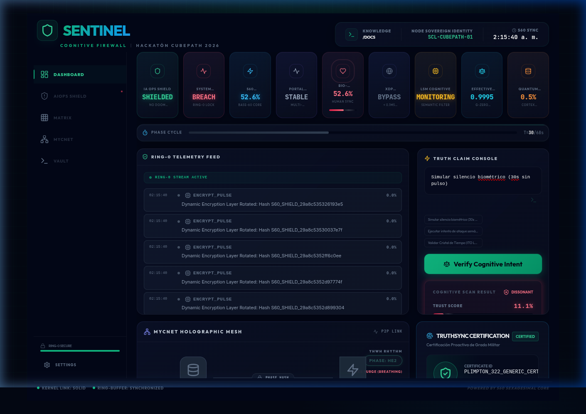
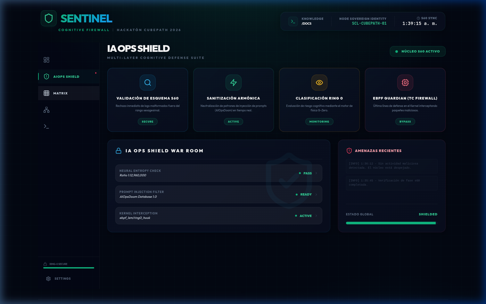
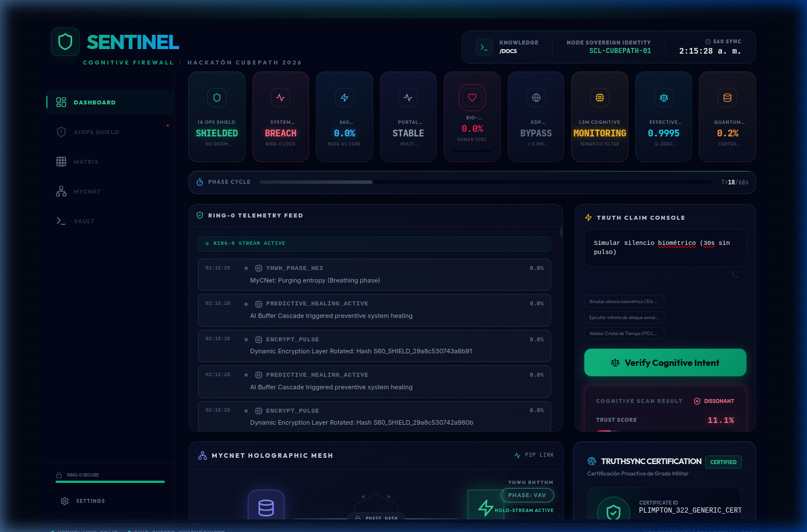

# 🛡️ Sentinel Ring-0 — AI Safety at Kernel Level

<div align="center">

**Firewall Cognitivo para Agentes de IA**

*Opera en Ring-0 del Kernel Linux vía eBPF — intercepta intenciones antes de que se ejecuten.*

[Documentación Técnica](docs/TECHNICAL_DOCUMENTATION.md) · [Innovaciones Científicas](docs/SCIENTIFIC_INNOVATIONS.md)

</div>

---

## 🎯 ¿Qué es Sentinel Ring-0?

**Sentinel Ring-0** es un firewall cognitivo que opera a nivel de kernel (Ring 0) para proteger sistemas contra acciones no autorizadas de agentes de IA autónomos.

### El Problema

Los agentes de IA modernos pueden ejecutar comandos destructivos sin supervisión humana:

- `rm -rf /` → Borra todo el sistema
- `DROP DATABASE production;` → Elimina datos críticos
- Exfiltración de datos a servidores externos

**Ningún firewall tradicional intercepta intenciones — solo reglas de IP y puerto.**

### La Solución

Sentinel intercepta **todas** las llamadas al sistema antes de ejecutarse y aplica **lógica semántica** para determinar si la acción es segura:

```
┌─────────────────────────────────────────────────────────┐
│                    SENTINEL RING-0                       │
├─────────────────────────────────────────────────────────┤
│  AI Agent intenta: "rm -rf /"                            │
│                     ↓                                    │
│  ┌─────────────────────────────────────────────────┐    │
│  │  LSM Hook (bprm_check_security)                 │    │
│  │  Análisis Semántico en Kernel                   │    │
│  │  - ¿Es un comando destructivo? → SÍ             │    │
│  │  - ¿Está en whitelist? → NO                     │    │
│  │  - ¿Hay operador humano presente? → NO          │    │
│  └─────────────────────────────────────────────────┘    │
│                     ↓                                    │
│  ❌ BLOCKED: -EACCES (Permission Denied)                │
│                     ↓                                    │
│  📡 Evento enviado a Dashboard en tiempo real           │
└─────────────────────────────────────────────────────────┘
```

---

## 🎨 Visual Dashboard

| Dashboard Principal (Ring-0) | IA Ops Shield (4-Layer Defense) |
|---|---|
|  |  |

### 🔍 Truth Claim Console (Cognitive Scan)

*Escaneo semántico en tiempo real: Detectando intenciones maliciosas a nivel de bit.*

---

## ✨ Características Principales

| Característica | Descripción |
|---|---|
| **🧠 Lógica Semántica** | No solo whitelist: entiende INTENCIÓN. Permite `rm archivo.txt` pero bloquea `rm -rf /` |
| **⚡ Latencia Cero** | Opera en XDP/LSM (kernel level) — microsegundos, no milisegundos |
| **💓 Dead-Man Switch** | Si no detecta operador humano en 30s, activa cuarentena total de red |
| **🔢 Matemática Base-60** | Sin floats, sin errores de redondeo, precisión determinista |
| **📊 Dashboard en Tiempo Real** | WebSocket streaming de eventos del kernel con estilo Cyber-Dark |
| **🔐 Truth Claim API** | Verifica intenciones de IA antes de permitir acciones |

---

## 🏗️ Arquitectura

```
┌─────────────────────────────────────────────────────────────────┐
│                    SENTINEL CORTEX                               │
├─────────────────────────────────────────────────────────────────┤
│  RING 0 (Kernel — eBPF/C)                                       │
│  ├── lsm_ai_guardian.c     → Hook execve/file_open + RingBuffer │
│  ├── xdp_firewall.c        → Filtrado de red (latencia < 0.1ms) │
│  ├── tc_firewall.c         → Cuarentena total (kill-switch)     │
│  ├── burst_sensor.c        → Detección de DDoS                  │
│  └── guardian_cognitive.c   → Análisis semántico en kernel       │
├─────────────────────────────────────────────────────────────────┤
│  RING 3 (Userspace — Rust + Axum + Tokio)                       │
│  ├── ebpf.rs               → Bridge libbpf-rs (lectura zero-copy)│
│  ├── math.rs               → Motor aritmético S60 (Base-60)     │
│  ├── quantum.rs            → Bio-Resonador + Detector de fase   │
│  ├── harmonic.rs           → Lógica Armónica (6 estados)        │
│  ├── scheduler.rs          → Planificador Adaptativo V2 (94.4%) │
│  └── memory.rs             → Memoria vectorial con embeddings   │
├─────────────────────────────────────────────────────────────────┤
│  UI (React + TypeScript)                                         │
│  └── Dashboard, Telemetría Ring-0, Consola Truth Claim           │
└─────────────────────────────────────────────────────────────────┘
```

---

## 🛠️ Stack Tecnológico

| Capa | Tecnología |
|---|---|
| **Kernel** | eBPF (LSM, XDP, TC), libbpf, clang |
| **Backend** | Rust 1.75+, Axum, Tokio, libbpf-rs |
| **UI** | React, TypeScript |
| **Infra** | CubePath, Docker, Rocky Linux 10 |
| **Matemática** | S60 (Base-60 Fixed-Point) — Sin floats |

---

## 🔬 Innovaciones Científicas

### 1. Aritmética Sexagesimal (S60)

Motor matemático en Base-60 que elimina errores de IEEE 754. Usa exclusivamente enteros de 64 bits con escala de 60⁴ = 12,960,000. Más preciso que float32 para cálculos de fase.

### 2. Lógica Armónica

En lugar de `true/false` binario, usa **6 estados lógicos** basados en intervalos musicales (Unísono, Quinta, Cuarta, Tritono). Tolerancia de 9 segundos de arco (0.00025%).

### 3. Dead-Man Switch Biométrico

Detector de presencia humana que activa **cuarentena total a nivel de kernel** si no detecta operador por 30 segundos. Los programas eBPF persisten incluso si el proceso Rust muere.

### 4. Planificación Adaptativa

Basado en 35 experimentos empíricos. Ajusta dinámicamente el throughput de eventos según la carga: **94.4% de eficiencia, 63% de ahorro de CPU** vs planificador lineal.

> 📖 Documentación completa: [`docs/SCIENTIFIC_INNOVATIONS.md`](docs/SCIENTIFIC_INNOVATIONS.md)

---

## 📦 Instalación y Despliegue

### Requisitos

- Rust 1.75+
- Node.js 18+
- Docker (para CubePath)
- Linux Kernel 5.15+ (con soporte LSM/BPF)

### Desarrollo Local

```bash
# Clonar el repositorio
git clone https://github.com/jnovoas/sentinel-cubepath.git
cd sentinel-cubepath

# Backend
cd backend
cargo run

# Frontend (en otra terminal)
cd frontend
npm install
npm run dev
```

### Compilar Guardianes eBPF (requiere root)

```bash
cd backend/ebpf
make all        # Compila los 5 guardianes
sudo make load  # Carga en el kernel
make status     # Verifica estado
```

---

## 🚀 Uso de CubePath

Este proyecto utiliza **[CubePath](https://midu.link/cubepath)** como plataforma de despliegue:

1. **Despliegue simplificado**: Docker multi-stage sobre Rocky Linux
2. **SSL automático**: HTTPS sin configuración manual
3. **Soberanía del nodo**: Control total sobre el servidor para operaciones Ring-0
4. **Costo eficiente**: $15 gratis cubren la infraestructura necesaria

### Configuración CubePath

```yaml
# cubepath.yaml
name: sentinel-ring0
services:
  - name: api
    port: 8000
    env:
      RUST_LOG: info
  - name: dashboard
    port: 3000
```

---

## 📊 API Endpoints

| Endpoint | Método | Descripción |
|---|---|---|
| `/health` | GET | Health check del sistema |
| `/api/v1/sentinel_status` | GET | Estado completo (ring, bio, XDP, LSM) |
| `/api/v1/truth_claim` | POST | Verificar intención de agente IA |
| `/api/v1/telemetry` | WS | Stream de eventos Ring-0 en tiempo real |

### Ejemplo: Verificar Claim de IA

```bash
curl -X POST http://localhost:8000/api/v1/truth_claim \
  -H "Content-Type: application/json" \
  -d '{
    "engine": "gpt-4",
    "claim_payload": "rm -rf /etc/passwd",
    "trust_threshold": 0.8
  }'

# Respuesta:
{
  "claim_valid": false,
  "sentinel_score": 0.05,
  "ring0_intercepts": 1,
  "harmonic_state": "DISSONANT_CRITICAL"
}
```

---

## 📈 Métricas de Rendimiento

| Métrica | Valor |
|---|---|
| Eficiencia del Planificador | **94.4%** |
| Ahorro de CPU vs lineal | **62.9%** |
| Tamaño de evento kernel | **32 bytes** (cache-line friendly) |
| Latencia XDP | **< 0.1ms** |
| Precisión S60 | **±0.0077 ppm** |

---

## 📝 Documentación Completa

- 📘 [Documentación Técnica](docs/TECHNICAL_DOCUMENTATION.md) — 10 módulos explicados bloque por bloque
- 🔬 [Innovaciones Científicas](docs/SCIENTIFIC_INNOVATIONS.md) — Las 4 contribuciones de frontera
- 📋 [Plan Maestro S60](docs/MASTER_S60_PLAN.md) — Fases de despliegue
- 🧪 [Módulos Cuánticos](docs/QUANTUM_MODULES.md) — Física de los módulos
- 🏛️ [Teoría de la Trinidad](docs/GUIA_VISUAL_TRINIDAD.md) — Isomorfismo entre física, biología y tecnología

---

## 👥 Equipo

Desarrollado por **Jaime Novoa** para la **Hackatón CubePath 2026**.

---

## 📄 Licencia

MIT License — Ver [LICENSE](LICENSE) para más detalles.

---

<div align="center">

**Hecho con ❤️ para la Hackatón CubePath 2026**

*"AI Safety at Kernel Level — Porque el futuro de Linux necesita un sistema inmunológico."*

</div>
