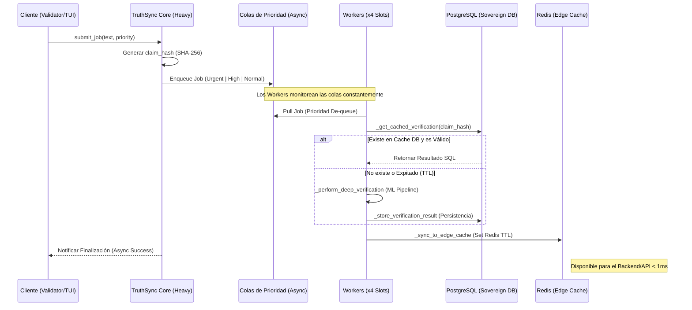

# 🛰️ TruthSync: Arquitectura de Flujo (Motor Pesado)

Este diagrama detalla el ciclo de vida de un **Job de Verificación**, desde la captura del claim hasta la sincronización en el Edge Cache.

## 🧜‍♂️ Diagrama de Secuencia UML

## ⚙️ Componentes Críticos

1.  **Prioridad Dinámica**: El sistema utiliza 3 colas paralelas. Los jobs `Urgent` tienen preferencia absoluta sobre los `Normal`, evitando que las validaciones masivas bloqueen el acceso en tiempo real a la API.
2.  **Persistencia Dual**: 
    *   **PostgreSQL**: Registro inmutable histórico de cada claim verificado.
    *   **Redis**: Espejo de alta velocidad para que el Sentinel Edge no tenga que consultar la DB pesada.
3.  **Worker Loop**: Operación no bloqueante que permite procesar miles de archivos con una latencia de ~100ms.

## 📈 Latencia Operacional Observada
- **Queue Overhead**: < 1ms
- **DB Lookup**: ~5-10ms
- **ML Analysis (Sim)**: ~100ms
- **Total Roundtrip**: **~112ms**
