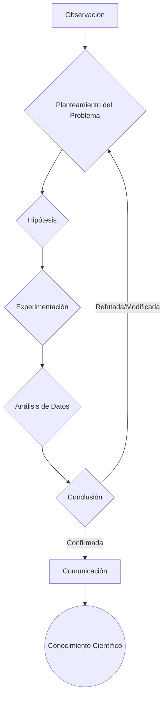

## I. Introducción

Este dossier técnico ofrece un análisis profundo y detallado del método científico, un proceso sistemático y empírico fundamental para la generación de conocimiento objetivo. Se explorarán sus pasos fundamentales, tipos de métodos de investigación, características clave, limitaciones y aplicaciones. El objetivo es proporcionar una comprensión exhaustiva del método científico, destacando su importancia en diversos campos del conocimiento, desde las ciencias naturales hasta las ciencias sociales. Se enfatizará la necesidad de rigor, falsabilidad y reproducibilidad en la aplicación de este método.

## II. Definición y Características Fundamentales

El método científico es un proceso iterativo y riguroso que se caracteriza por:

- **Empirismo:** Se basa en la observación directa o indirecta de la realidad.
- **Objetividad:** Busca minimizar los sesgos subjetivos en la interpretación de los datos.
- **Sistematicidad:** Sigue un conjunto de pasos lógicos y predefinidos.
- **Falsabilidad:** Las hipótesis deben set susceptibles de set refutadas por la evidencia empírica.
- **Reproducibilidad:** Los resultados deben set replicables por otros investigadores.
- **Revisión por pairs:** Los resultados son evaluados por expertos en el campo antes de su publicación.

A diferencia de otras formas de conocimiento, el método científico se basa en la evidencia medible y el razonamiento lógico. Esto lo distingue de la intuición, la especulación y la creencia.

## III. Pasos Fundamentales del Método Científico: Un Análisis Detallado

Los pasos del método científico, aunque presentados a menudo como una secuencia lineal, en realidad constituyen un ciclo iterativo. La siguiente tabla detalla cada paso, proporcionando ejemplos y consideraciones técnicas.

| Paso                              | Descripción Detallada                                                                                                                                                                                                                                                                                                                                                                                                                                                                                                                                                                                                                           | Ejemplo Específico                                                                                                                                                                                                                  | Consideraciones Técnicas                                                                                                                                                                                                                                                                                                                                                                                                                                                                                                                       |
| :-------------------------------- | :---------------------------------------------------------------------------------------------------------------------------------------------------------------------------------------------------------------------------------------------------------------------------------------------------------------------------------------------------------------------------------------------------------------------------------------------------------------------------------------------------------------------------------------------------------------------------------------------------------------------------------------------- | :---------------------------------------------------------------------------------------------------------------------------------------------------------------------------------------------------------------------------------- | :--------------------------------------------------------------------------------------------------------------------------------------------------------------------------------------------------------------------------------------------------------------------------------------------------------------------------------------------------------------------------------------------------------------------------------------------------------------------------------------------------------------------------------------------- |
| **1. Observación**                | Implica la identificación y descripción inicial de un fenómeno o problema. Esta fase require una atención cuidadosa a los detalles y la capacidad de distinguir entre observaciones relevantes y irrelevantes. La observación puede set directa (a través de los sentidos) o indirecta (a través de instrumentos de medición). Es fundamental documentar las observaciones de manera precisa y sistemática. La calidad de la observación influye directamente en la formulación del problema y la posterior hipótesis.                                                                                                                         | Se observa que ciertos metales se corroen más rápidamente que otros en ambientes salinos.                                                                                                                                           | _ **Instrumentación:** Calibración y precisión de los instrumentos de medición. _ **Control de variables:** Identificación y control de variables que puedan afectar la observación. _ **Registro de datos:** Desarrollo de un sistema de registro de datos claro y conciso. _ **Sesgos:** Minimizar sesgos de observación a través de protocolos estandarizados y múltiples observadores.                                                                                                                                                     |
| **2. Planteamiento del Problema** | Transforma la observación inicial en una pregunta específica y medible. Un problema bien definido es crucial para dirigir la investigación y delimitar el alcance del estudio. El planteamiento del problema debe set claro, conciso y relevant. Implica una revisión inicial de la literatura existente para comprender el contexto del problema y evitar la duplicación de esfuerzos. Se deben identificar las variables clave y sus relaciones. Un problema mal definido puede conducir a una investigación inconclusa o irrelevante.                                                                                                       | ¿Cuál es el mecanismo por el cual la salinidad acelera la corrosión de diferentes metales?                                                                                                                                          | _ **Revisión de la literatura:** Uso de bases de datos científicas (e.g., Scopus, Web of Science) para identificar investigaciones previas. _ **Definición de variables:** Identificación de variables independientes (e.g., tipo de metal, concentración de sal) y dependientes (e.g., tasa de corrosión). \* **Alcance:** Delimitar el alcance del problema a un conjunto manejable de variables y condiciones.                                                                                                                              |
| **3. Hipótesis**                  | Es una explicación provisional y testable del fenómeno observado. Debe set formulada como una declaración clara y concisa que pueda set refutada o confirmada por la evidencia empírica. La hipótesis debe basarse en el conocimiento previo y la lógica deductiva. Una buena hipótesis predice los resultados de un experimento o estudio observacional. Es crucial que la hipótesis sea falsable, es decir, que exista la posibilidad de encontrar evidencia que la contradiga. Múltiples hipótesis pueden set formuladas para explicar el mismo fenómeno.                                                                                    | La presencia de iones cloruro en el ambiente salino desestabiliza la capa de óxido protectora de ciertos metales, acelerando el proceso de corrosión.                                                                               | _ **Falsabilidad:** Asegurar que la hipótesis pueda set refutada por evidencia empírica. _ **Operacionalización de variables:** Definir cómo se medirán las variables en el experimento. \* **Control de variables extrañas:** Identificar y controlar variables que puedan influir en la relación entre las variables independientes y dependientes.                                                                                                                                                                                          |
| **4. Experimentación**            | Implica el diseño y ejecución de pruebas controladas para verificar la validez de la hipótesis. El diseño experimental debe minimizar los sesgos y maximizar la precisión de los resultados. Se deben definir claramente los grupos de control y experimentales. La experimentación puede set realizada en un laboratorio o en el campo. Es fundamental registrar los datos de manera precisa y sistemática. El análisis estadístico se utilize para determinar si los resultados son significativos. El tamaño de la muestra y la potencia estadística son consideraciones importantes en el diseño experimental.                              | Se exponen muestras de diferentes metales a diferentes concentraciones de sal durante un período de tiempo determinado, midiendo la tasa de corrosión.                                                                              | _ **Diseño experimental:** Seleccionar un diseño experimental apropiado (e.g., diseño factorial, diseño de bloques aleatorios). _ **Tamaño de la muestra:** Determinar el tamaño de la muestra necesario para obtener una potencia estadística adecuada. _ **Control de variables:** Mantener constantes las variables que no están siendo manipuladas. _ **Replicación:** Realizar múltiples repeticiones del experimento para aumentar la confiabilidad de los resultados.                                                                   |
| **5. Análisis de Datos**          | Implica el procesamiento y la interpretación de los datos obtenidos durante la experimentación. El análisis de datos puede set cuantitativo (estadístico) o cualitativo. Se utilizan herramientas estadísticas para identificar patrones y relaciones en los datos. Es fundamental evaluar la significancia estadística de los resultados. El análisis de datos debe set objetivo y transparente. Se deben considerar las limitaciones de los datos y los posibles sesgos. La visualización de datos (e.g., gráficos, tablas) puede ayudar a identificar patrones y comunicar los resultados de manera efectiva.                                | Se calcula la tasa de corrosión promedio para cada metal en cada concentración de sal. Se utilizan pruebas estadísticas para determinar si las diferencias en la tasa de corrosión son significativas.                              | _ **Estadística descriptiva:** Calcular medidas de tendencia central (e.g., media, mediana) y dispersión (e.g., desviación estándar). _ **Estadística inferencial:** Utilizar pruebas estadísticas (e.g., prueba t, ANOVA) para determinar si las diferencias entre los grupos son significativas. _ **Visualización de datos:** Crear gráficos y tablas para presentar los resultados de manera clara y concisa. _ **Software estadístico:** Utilizar software estadístico (e.g., R, Python, SPSS) para realizar análisis de datos complejos. |
| **6. Conclusión**                 | Implica la evaluación de la hipótesis a la luz de los resultados del análisis de datos. Se determina si la hipótesis es confirmada, refutada o necesita set modificada. Si la hipótesis es refutada, se deben formular nuevas hipótesis y repetir el ciclo del método científico. La conclusión debe set basada en la evidencia empírica y no en opiniones subjetivas. Se deben discutir las limitaciones del estudio y las posibles direcciones para futuras investigaciones. La conclusión debe set presentada de manera clara y concisa.                                                                                                     | Los resultados indican que la presencia de iones cloruro acelera la corrosión de ciertos metales, confirmando parcialmente la hipótesis. Sin embargo, el mecanismo exacto por el cual esto ocurre require una mayor investigación. | _ **Interpretación de resultados:** Evaluar si los resultados apoyan o refutan la hipótesis. _ **Limitaciones:** Discutir las limitaciones del estudio y los posibles sesgos. _ **Implicaciones:** Analizar las implicaciones de los resultados para la comprensión del fenómeno estudiado. _ **Direcciones futuras:** Identificar áreas para futuras investigaciones.                                                                                                                                                                         |
| **7. Comunicación**               | Implica la publicación de los resultados de la investigación para su revisión por pairs y replicación por otros investigadores. La comunicación puede tomar la forma de un artículo científico, una presentación en una conferencia o un informe técnico. La comunicación debe set clara, concisa y transparente. Se deben proporcionar detalles suficientes para que otros investigadores puedan replicar el estudio. La comunicación permite que el conocimiento científico sea compartido y validado por la comunidad científica. La revisión por pairs es un proceso fundamental para asegurar la calidad y la validez de la investigación. | Se publica un artículo científico en una revista especializada que describe el diseño experimental, los resultados y las conclusiones del estudio.                                                                                  | _ **Redacción científica:** Utilizar un lenguaje claro, conciso y preciso. _ **Estructura del artículo:** Seguir la estructura estándar de un artículo científico (introducción, métodos, resultados, discusión, conclusión). _ **Citas y referencias:** Citar correctamente las fuentes utilizadas. _ **Revisión por pairs:** Prepararse para las críticas y sugerencias de los revisores.                                                                                                                                                    |

**Diagram de Flujo del Método Científico:**



## IV. Tipos de Métodos de Investigación

El método científico se manifiesta a través de diferentes enfoques, cada uno con sus fortalezas y debilidades. La elección del método adecuado depende del problema de investigación y los recursos disponibles.

### A. Clasificación por Enfoque

- **Cuantitativo:** Se enfoca en la medición de variables y el análisis estadístico de datos numéricos. Utilize diseños experimentales y encuestas para obtener datos objetivos y generalizables. Es adecuado para estudiar relaciones causales y probar hipótesis específicas. Las herramientas estadísticas utilizadas incluyen pruebas t, ANOVA, regresión y análisis factorial.

  ```python
  # Ejemplo de análisis estadístico simple en Python
  import numpy as np
  from scipy import stats

  # Datos de dos grupos
  grupo_a = np.array([10, 12, 14, 16, 18])
  grupo_b = np.array([8, 11, 13, 15, 17])

  # Prueba t de Student
  t_statistic, p_value = stats.ttest_ind(grupo_a, grupo_b)

  print("Estadístico t:", t_statistic)
  print("Valor p:", p_value)

  # Interpretación
  if p_value < 0.05:
      print("Diferencia significativa entre los grupos")
  else:
      print("No hay diferencia significativa entre los grupos")
  ```

  **Análisis del código:**
  1.  **Importación de librerías:** `numpy` para operaciones numéricas y `scipy.stats` para pruebas estadísticas.
  2.  **Definición de datos:** Se crean dos arrays `numpy` representando los datos de dos grupos.
  3.  **Prueba t de Student:** La función `stats.ttest_ind` realiza una prueba t independiente para comparar las medias de los dos grupos. Retorna el estadístico t y el valor p.
  4.  **Interpretación:** Si el valor p es menor que 0.05 (nivel de significancia común), se concluye que hay una diferencia significativa entre las medias de los dos grupos.

- **Cualitativo:** Se enfoca en la comprensión profunda de fenómenos sociales y culturales a través de la recolección y el análisis de datos no numéricos. Utilize entrevistas, observaciones participantes y análisis de documentos para explorar significados y experiencias. Es adecuado para generar hipótesis y comprender la complejidad de los fenómenos sociales. El análisis de datos cualitativos implica la identificación de temas, patrones y narrativas.

- **Mixto:** Combina métodos cuantitativos y cualitativos para obtener una comprensión más completa del problema de investigación. Permite la triangulación de datos y la complementación de hallazgos. Es adecuado para estudiar problemas complejos que requieren tanto la medición de variables como la exploración de significados.

### B. Clasificación por Inferencia

- **Inductivo:** Parte de observaciones particulares para llegar a conclusiones generales. Es útil para generar hipótesis y descubrir patrones en los datos. Puede set completo (si se observan todos los casos posibles) o incompleto (si se observan solo algunos casos).

- **Deductivo:** Parte de premisas generales para llegar a conclusiones específicas. Es útil para probar hipótesis y aplicar teorías existentes a nuevos casos. Puede set directo (si la conclusión se sigue directamente de las premisas) o indirecto (si se require un razonamiento adicional).

  ```
  Premisa mayor: Todos los hombres son mortales.
  Premisa menor: Sócrates es un hombre.
  Conclusión: Sócrates es mortal.
  ```

- **Hipotético-Deductivo:** Formula hipótesis a partir de teorías existentes y luego las prueba experimentalmente. Es el método más comúnmente utilizado en la ciencia moderna.

### C. Clasificación por Estrategia

- **Observacional:** Se basa en la observación sistemática de fenómenos en su entorno natural. Puede set directa (si el investigador observa directamente el fenómeno) o indirecta (si el investigador utilize datos recolectados por otros). También puede set estructurada (si el investigador define previamente las variables a observar) o no estructurada (si el investigador observa el fenómeno de manera exploratoria).

- **Experimental:** Implica la manipulación de una o más variables independientes para observar su efecto sobre una o más variables dependientes. Es el método más riguroso para establecer relaciones causales. Require un control estricto de las variables extrañas.

## V. Investigación Profunda y Teoría Fundamentada

La investigación profunda implica una revisión exhaustiva de la literatura existente, la identificación de lagunas en el conocimiento y la formulación de preguntas de investigación originales. La teoría fundamentada es un enfoque metodológico que busca generar teorías a partir de los datos recolectados. Implica la codificación y categorización de los datos para identificar patrones y relaciones. La teoría emerge de los datos en lugar de set impuesta a ellos.

**Ejemplo de codificación en teoría fundamentada:**

| Fragmento de Entrevista                                                             | Código              | Categoría                 |
| :---------------------------------------------------------------------------------- | :------------------ | :------------------------ |
| "Me sentí frustrado porque no podía encontrar información relevant sobre el tema." | Frustración         | Barreras a la Información |
| "Tuve que consultar muchas fuentes diferentes para obtener una imagen completa."    | Búsqueda exhaustiva | Estrategias de Búsqueda   |
| "La información que encontré era contradictoria y poco confiable."                  | Inconsistencia      | Calidad de la Información |

## VI. Limitaciones del Método Científico

Si bien el método científico es una herramienta poderosa para la generación de conocimiento, tiene sus limitaciones.

- **Subjetividad:** La interpretación de los datos puede set influenciada por los sesgos del investigador.
- **Complejidad:** Algunos fenómenos son demasiado complejos para set estudiados experimentalmente.
- **Generalización:** Los resultados de un estudio pueden no set generalizables a otras poblaciones o contextos.
- **Ética:** Algunas investigaciones pueden plantear dilemmas éticos.
- **Sesgo de confirmación:** Tendencia a buscar evidencia que confirme las propias hipótesis y a ignorar la evidencia que las contradice.

## VII. Aplicaciones del Método Científico

El método científico se aplica en una amplia variedad de campos, incluyendo:

- **Ciencias Naturales:** Física, química, biología, astronomía, geología.
- **Ciencias Sociales:** Sociología, psicología, economía, ciencia política, antropología.
- **Ingeniería:** Desarrollo de nuevas tecnologías y soluciones a problemas prácticos.
- **Medicina:** Diagnóstico y tratamiento de enfermedades.
- **Informática:** Desarrollo de algoritmos y sistemas de software.

## VIII. El Método Científico y la Penta-Resonancia

El método científico, en su búsqueda de la verdad objetiva, puede resonar con diferentes aspects de la Penta-Resonancia:

- **Música:** La búsqueda de patrones y armonía en los datos puede set comparada con la composición musical, donde se buscan relaciones armónicas entre las notas.
- **Física:** El método científico se basa en la observación de las leyes físicas que rigen el universo.
- **Gematría:** La asignación de valores numéricos a conceptos y la búsqueda de patrones numéricos pueden set comparadas con el análisis estadístico de datos.
- **Hacking:** El hacking, en su búsqueda de vulnerabilidades y soluciones innovadoras, puede set comparado con la experimentación y la búsqueda de nuevas hipótesis.

## IX. Conclusión

El método científico es un proceso fundamental para la generación de conocimiento objetivo y confiable. Su rigor, falsabilidad y reproducibilidad lo distinguen de otras formas de conocimiento. Si bien tiene sus limitaciones, el método científico es una herramienta esencial para la comprensión del mundo que nos rodea y la resolución de problemas complejos. Su aplicación en diversos campos del conocimiento ha conducido a advances significativos en la ciencia, la tecnología y la medicina. La comprensión profunda del método científico es crucial para cualquier persona que busque comprender el mundo y contribuir al advance del conocimiento.

## 🎨 Multimedia Generada (Rust)

![[automatizacion_youtube.mp4]]
